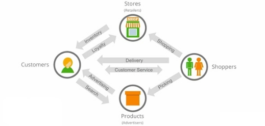
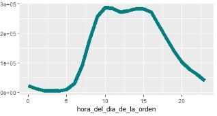
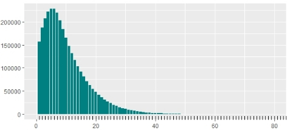
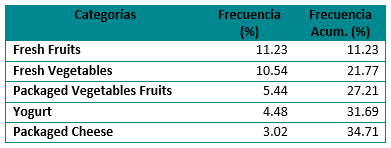
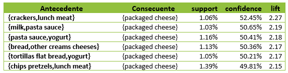
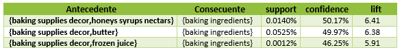
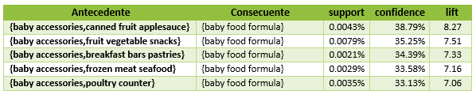

# SISTEMA DE RECOMENDACIÓN DE PRODUCTOS

# Comprensión del negocio
### Determinar objetivos del negocio
#### **Contexto**
Instacart es una compañía cuya propuesta de valor se centra en entregar víveres de tiendas que sus clientes ya conocen y adoran en su puerta en una hora. La cual se basa en un modelo de cuatro lados, que involucra a los clientes, los compradores, las tiendas y los productos. Donde cada lado presenta necesidades y objetivos diferentes.

Al realizar un análisis de Porter encontramos:

#### **Objetivos de negocio**
- Diseñar estrategias que apoyen a los clientes en la selección de productos.  
- Lograr una preferencia de los clientes por lo virtual antes de ir a la tienda.
- Diseñar asociaciones de productos enfocadas a las características de los clientes.
- Diseñar estrategias de mercadeo que permitir estimular la venta de las categorías de bajo a medio consumo.
#### **Criterios del éxito del caso**
- Encontrar seis o más asociaciones de productos significativas que involucren productos de demanda media.
- Presentar al menos dos estrategias de venta que involucren la asociación con las tiendas de productos.
- Identificar horarios de consumo de los clientes para saber en qué momento enviar las ofertas promocionales sobre las asociaciones.
### ` `Determinar objetivos de la minería de datos
- Determinar asociaciones entre los productos o las categorías de productos que permitan implementar estrategias de venta cruzada.
#### **Criterios de éxito de la minería**
- Encontrar asociaciones que se relaciones con el perfil estadunidense de comprador online que tengan lifts significativos.
- Evaluar cuales son los horarios que ofrecen una mayor posibilidad de compra de los productos consecuentes del modelo.
## Compresión de datos
### Descripción de los datos
La base está conformada por 6 tablas que detalla la información de ordenes realizadas a Instacard, se cuentan con tres tablas maestras con la información de productos y sus categorías y tres tablas transaccionales una con la información general de la orden (cliente\_id, día de la semana, hora entre otras) y dos tablas adicionales con el detalle de productos por orden una order\_products\_prior con 32.434.489 con el total de las ordenes liberadas, otra order\_products\_train con 1.384.617 una base de igual estructura a la anterior, pero con una muestra reducida de datos. 
### Estructura de los datos
A continuación, diagrama relacional de la base, indicando tipo de datos en cada tabla y campos llaves entre las mismas.

#### **Granularidad**
Existen dos niveles de granularidad en la base de datos y son las agrupaciones de productos uno llamado departaments (departamentos) con 21 categorías y otra aisle (pasillo) 134 categorías, las dos tablas están relacionadas con productos y no entre ellas así la navegación es de departaments a productos y de aisle a producto. 
#### **Temporalidad**
La información fue liberada en el año 2017, pero no se tiene definido un rango de fechas. Se cuenta con el detalle por orden del día de la semana y hora en fue realizada cada orden. 
#### **Geografía**
La información es de clientes estadounidense pero no se dispone de datos georreferenciados o información de ubicación en términos de estado y ciudad.
### Exploración de datos
#### **Sentido de negocio**
Teniendo en cuenta el interés de la compañía en presentar recomendaciones que impliquen temporalidad. Se comienza el estudio evaluando como es el comportamiento de los datos en las dos dimensiones temporales presentes, días de la semana y horario de compra. 

Donde se encuentra que los días de más alto consumo son el día cero y el día uno lo cual se a supuesto en los diversos estudios sobre el mismo conjunto de datos que son los días sábado y domingo. Adicionalmente, las horas de mayor demanda son entre las 8:00am y las 5:00pm

## **Implicaciones de análisis**
Desde la perspectiva de la aplicación del modelo es necesario conocer, cual es el peso que tienen las diferentes entidades del negocio dentro de los datos, como se ilustra en las gráficas donde todo parece ser congruente con el comportamiento de una base transaccional de una tienda de retail. Donde los productos mas vendidos son los principales de la canasta son verduras, frutas, lácteos, entre otros.

Tomado de: https://medium.com/@dimitrilinde/exploring-the-instacart-online-grocery-shopping-dataset-2017-86db5156da2c

## **Conocimiento obtenido**
Luego de los diferentes análisis se puede observar que los productos más vendidos son de las categorías de comidas que forman la canasta básica, en particular frutas y vegetales frescos. Existe una marcada diferencia entre las compras por categorías observando que el 50% del total de las compras están en 13 de las 134 categorías, por cual estás primeras categorías estarían en la mayoría de las transacciones de la base estudiada.

También se encuentra que la mayoría de los clientes se concentran en unas compras inferiores a 45 productos con una mayor proporción entre ocho a doce productos por orden que involucran de cinco o seis categorías y en el tiempo del estudio la mayoría de los clientes han realizado menos de 25 órdenes.
### Verificación de la calidad de los datos
Dentro de los datos que tenemos en los diferentes sets de datos vemos que la única variable que presenta datos no disponibles en algunas de las ordenes es days\_since\_prior\_order, esto debido a que hay ordenes en las cuales el producto se ordena por primera vez o después de 30 días. Por otro lado, se observa que las demás variables de los sets están completas y se presume que por ser datos recogidos mediante la aplicación de instacart tienen un porcentaje muy pequeño de error asociado. 

Preparación de los datos
### Selección de los datos
El análisis de relación se realizará a través de las categorías de productos (aísles), para luego implementar las estrategias de venta cruzada entre ellas. Se busca promover la venta de los productos que no son tan vendidos.

Cómo nos interesa la mayor información posible de la base se trabajará el modelo con la base order\_products\_\_prior, la cual tiene un conjunto más completo de los datos.
### Limpieza de los datos
Como se observó en la exploración de datos hay ordenes con un número elevado de productos comprados, es decir, existe la posibilidad que algunas ordenes sean atípicas y puedan influir en los resultados del modelo. 

El comportamiento de los datos presenta algunos saltos entre el número de productos en las órdenes de compra, además se evidencia la presencia de bastantes atípicos en la parte superior del gráfico, pero no presenta un comportamiento que se ajuste a una normal, es por esto que se decide aplicar el método de k-means, el cual es apropiado para una sola variable y para tratar de diferenciar clústeres y de esta manera detectar los datos que realmente son atípicos.

Con el grafico de codo se puede detectar que el cambio en suma de cuadrados se estabiliza a partir de en 12 clústeres, es decir estos son el número de grupos para diferenciar y se obtienen los siguientes resultados.

``

Se observan tamaños muy pequeños en los clústeres 2, 3 y 5, además son los que presentan valores más altos en los centroides, por consiguiente, se eliminan estos clúster ya que se identifican como atípicos que pueden causar ruido en el modelo.
### Estructuración de los datos
A fin de tener la información de las órdenes a nivel de categorías se deben integrar las tablas de *order\_products\_\_pior*, *products* y *aísles*, obteniendo un único dataset con el identificador de cada orden, identificar de la categoría del producto comprado y nombre de la categoría del producto comprado y demás campos de cada tabla.
### Formateo de los datos	
Al conjunto de datos obtenidos de la estructuración se deja un nuevo datase con solo las columnas relevantes para el estudio, identificador de cada orden, identificar de la categoría del producto comprado y nombre de la categoría del producto comprado.

Adicionalmente, como se observa la fuerte participación de ciertas categorías en la mayoría de las órdenes y a fin de fortalecer las relaciones entre las demás categorías las cuales es interés de la compañía promover se decide eliminar aquellas transacciones que contengan únicamente los elementos de las primeras 5 categorías las cuales son:

Este filtrado eliminó 86.453 transacciones de los 3.206.218 originales obtenidos luego de la limpieza

Modelado
### Generación de un plan de prueba
Como plan de pruebas del modelo, a las reglas más representativas se evaluará los resultados del lift, esperado que estos valores sean significativos a la hora de determinar estrategias accionables. Tomando en cuenta que el valor del lift es el grado en que la consecuencia no está relacionada con las variables antecesoras por causalidad.
### Construcción del modelo
Debido a que para el caso solo se tiene información sobre las transacciones que realizan los clientes en la compañía se trabaja con sistema de recomendación basado en contenido, con el fin de entender las posibles asociantes que tienen los productos. Para esto se decide trabajar con algoritmo a prior por sus ventajas de rendimiento cuando se manejan grandes cantidades de datos debido a que la matriz con la cual se está trabajando es de 135 categorías de productos y aproximadamente 3 millones de transacciones.
#### **Configuración de parámetros**
Se comenzó a estudiar de manera global ejecutando el algoritmo a priori con una confianza del 70% y un soporte de 10%, con lo que, solo se obtuvieron reglas relacionadas al 4% de las categorías, lo cual no era viable con respecto a los objetivos del negocio. Entonces, se decide bajar el soporte hasta un nivel de 0,0001%, que se determina como un nivel en el cual las reglas generadas cumplen con algunos de los objetivos planteados.

También se decide bajar el nivel de confianza del modelo debido a que la mayoría de las categorías por tamaño de la base no presentan niveles de confianza alta, lo que genera que solo queden reglas de asociación entorno a los productos de mayor consumo de la base determinando así una confianza del 30%; sin embargo, esto genera que aumenta la cantidad de reglas generando 56.467. Debido al número de reglas generadas por el modelo se priorizará primero aquellas donde las 5 categorías principales son el consecuente y los antecedentes son categorías de exposición muchos más baja. 
#### **Minado de reglas**
Se decide estudiar reglas a analizar categorías identificadas con de interés para promover según objetivo de negocio entorno a fidelizar a los clientes online y enfocar las ventas a las características de los clientes, de manera que se decide estudiar las reglas cuya consecuencia son productos en las categorías: baby food formula, baking ingredients, red wines, tofu meat alternatives, white wines; las cuales se asocian con dos de los grupos de mayor consumo que son las mujeres y los millennials según el estudio realizado por Hartman group. Los primeros relacionados con las compras que involucran vinos, pastelería y comida para bebé; y los segundas más relacionados con el consumo de productos vegetarianos los cuales son un preferente de las nuevas generaciones (Pellman,2018). La selección de las reglas de estas categorías principales se hará de acuerdo con mayor valor de lift y soporte mayor.
####
#### **Ejecución del modelo**
**Reglas de categorías más frecuentes**

A continuación, se presenta una muestra los resultados obtenidos en la ejecución del modelo para las categorías más frecuentes:

**Reglas Filtrado Consecuente Vino Blanco**

Se generan 23 reglas las cuales tienen como consecuente vino blanco, vemos que en la mayoría de las reglas que incluye vino blanco, los vinos rojos hacen parte del consecuente, sin embargo, se identifican reglas interesantes con altos lift para incluirlas en los planes de mercadeo.

|**Antecedente**|**Consecuente**|**support**|**confidence**|` `**lift** |
| :-: | :-: | :-: | :-: | :-: |
|**{air fresheners candles,specialty wines champagnes}** |{white wines}|0\.0019%|38\.67%|`  `47.95 |
|**{kitchen supplies,red wines}** |{white wines}|0\.0013%|34\.43%|`  `42.69 |

**Reglas Filtrado Red Whines**

Se generan 20 reglas las cuales tienen como consecuente vinos rojos, se seleccionan reglas con altos lift que pueden generar ideas de promoción interesantes para los clientes. Abajo las seleccionadas para desarrollar.

|**Antecedente**|**Consecuente**|**support**|**confidence**|` `**lift** |
| :-: | :-: | :-: | :-: | :-: |
|**{beers coolers,white wines}** |{red wines}|0\.0743%|51\.11%|`  `63.23 |
|**{soy lactosefree,white wines}** |{red wines}|0\.02%|30\.06%|`  `37.19 |
|**{packaged produce,white wines}** |{red wines}|0\.01%|35\.84%|`  `44.33 |

**Reglas Filtrado Consecuente Vino Rojo**

Se generan 4 reglas las cuales tienen como consecuente tofu, tres de ellas relacionadas a productos veganos o vegetarías o comidas especializadas como asiática e Indú.  Abajo las seleccionadas para desarrollar.

|**Antecedente**|**Consecuente**|**Support**|**Confidence**|**Lift**|
| :-: | :-: | :-: | :-: | :-: |
|**{baby accessories,frozen vegan vegetarian}** |{tofu meat alternatives}|0,0038%|33,62%|10,00|
|**{frozen vegan vegetarian,indian foods}** |{tofu meat alternatives}|0,0102%|32,39%|9,63|
|**{bulk grains rice dried goods,frozen vegan vegetarian}** |{tofu meat alternatives}|0,0072%|32,19%|9,58|
|**{asian foods,frozen vegan vegetarian}** |{tofu meat alternatives}|0,0657%|33,14%|9,86|

**Baking Ingredients**

Se observan 16 reglas donde, la regla butter y baking supplies decor con  relación con la categoría baking ingredients tiene el lift más alto y con mayor soporte  entre todas las reglas que tienen como consecuente la categoría de baking ingredients.

**Baby accessories**

Se presentan 18 reglas la cuales en su mayoría también están relacionadas, con la categoría de alimento para bebes y con lifts altos, compotas y snacks de frutas.

### Evaluación del modelo
Se valida que las reglas sobre las cuales se basen estrategias en base a los resultados finales presenten valores de lift mayores de 5 para reglas con baja confianza, y mayores al 50% de confianza para lits entre 1 y 5. 

Evaluación
### Evaluación de los resultados
Adicionalmente a las reglas identificadas para las categorías de mayor venta, se logró encontrar reglas accionables para productos de categoría media que están enfocados hacia mujeres y millennials. Complementariamente como se muestra a continuación también se logra encontrar como estas asociaciones se pueden vender mejor en ciertos horarios con el fin de complementar los resultados. 

**asian foods,frozen vegan vegetarian => tofu meat alternatives**: Por ser una regla asociada que muestra una clara relación entre productos para comidas fuertes almuerzo y cena su consumo se dispara desde las 10:00 a.m. a las 17:00 p.m. se podría implementar sugerencias con ofertas de page uno y lleve dos para la categoría consecuente ya que son productos que posiblemente se consumen en varios días de la semana.

**soy lactosefree, white wines => red wines**: Esta regla presenta un pico de 14:00 a 15:00, al ser bebidas alcohólicas y bebidas de soya podríamos pensar en un cliente millenian realizando las compras de su desayuno para el siguiente día y vinos para acompañar sus comidas, este tipo de cliente los cuales se identifican con el consumo de productos alternativos considerados saludables, se podría pensar en ofrecer los productos de la categoría consecuente vinos, pero con la característica de ser productos sustentables una valor importante para este segmento. 

**baking supplies decor,honeys syrups nectars => baking ingredients:** Esta regla presenta una importante demanda desde las 7:00 a.m. lo que se relaciona con su interpretación de ingredientes para panqueques un desayuno tradicional americano. Se pueden disparar sugerencias de combo desayuno en estos horarios.

**baking supplies decor,spices seasonings => baking ingredients:** Esta regla tiene una incidencia más alta en los horarios ce 11:00 p.m. y 14: 00 p.m. lo que llevaría a pesar de que se está realizando la compra de recetas de horneado para la tarde, se podría pensar en sugerir los productos nuevos de la categoría consecuente en las horas pico para estimular su compra en los clientes.

**baby accessories,canned fruit applesauce => baby food formula**: Esta regla de asociación de productos para bebes presenta una activación desde 07:00 a.m. a 14:00 a.m. el horario normal en que las madres disponen para revisar sus despensas, se pueden ofrecer ofertas de servicio de entrega con descuento si lleva productos en las tres categorías.   
# Implementación
### Informe final
Luego de analizar la información entregada por Instacart se planteó diseñar un modelo de reglas de asociación que ayudara a cumplir los objetivos de negocio. Luego de la ejecución y análisis de resultados se proponen las siguientes estrategias para las primeras 5 categorías en ventas y un despliegue de estrategias especiales para las categorías de consumo medio a bajo.

**Estrategia de “No olvides llevar”:** Para las reglas de las 5 categorías principales fresh fruits, fresh vegetables, yogurt, packaged vegetables fruits, packaged cheese la estrategia de no “No olvides llevar” en la aplicación sugerirá dentro del proceso de compra principal del cliente los 5 productos más vendidos y/o valorados de la categoría del consecuente. Debido a que las reglas poseen un soporte importante se garantiza una alta exposición para las sugerencias, además de apoyar los procesos de compra de los clientes al sugerir los productos más comunes de acuerdo a su canasta, permite aumentar la exposición y por ende las compras de las categorías asociadas con menor consumo.

**Estrategia de oferta de complementos:** Para aquellas reglas que muestran asociación de productos naturalmente relacionados como por ejemplo beers coolers, white wines è red wines, la aplicación 

**Estrategia Productos por descubrir:** Para aquellas asociaciones que se identifican como fuertes y que pueden ayudar a inferir el perfil del cliente como por ejemplo kitchen supplies, red wines  è white wines, donde se pensaría en un ama de casa, la aplicación sugeriría para que probará 5 productos más vendidos de la categoría del consecuente con un descuento que motive la compra.

**Estrategias Descuentos de Productos X Horario:** Para las reglas que hemos identificado como de interés por objetivo de negocio, se diseñaría una estrategia de oferta de descuentos a productos por horario. Para los clientes que en su canasta tengan los productos del antecedente se le ofrecería el producto del consecuente con un descuento sobre este, el cual sería de mayor valor en las horas valles y de menor valor en las horas picos de ocurrencia de la regla esto para promover las compras en los horarios valle.

**Estrategia segundo esposo:** Para las reglas cuyo consecuente es baby asesories, se quiere reafirmar el compromiso de la compañía con el bienestar de sus clientes basados en lema “we are your second husband” que expresan la idea de que cuando se tienen bebes en casa nunca es suficiente un solo esposo. Para lo cual, cada vez que se efectúe la compra de alguna de las reglas, instacart realice un descuento sobre el precio de envío basándose en el lema de la campaña, con el fin de aumentar la lealtad de los clientes a las apps y la preferencia por lo virtual antes de ir a la tienda.

**Estrategia la tienda que piensa en las personas que amas:** Se plantea hacer una asociación con los retails más grandes la cual este atada a la estrategia del segundo esposo. Con el fin de que cada vez que se elija las categorías precedentes a baby asesories, las tiendas les regalen a sus clientes vía instacart un accesorio para tu bebe e instacart inmediatamente ofrezca accesorios de mayor margen para tartar de enlazar la compras que aumenten las ganancias de las tiendas. De igual manera también se quiere aumentar la lealtad entre tienda y cliente.** 

Es natural que se presente esta regla sin embargo una estrategia para impulsar más esta asociación es que cuando se compre baking ingredients, sugerir inmediatamente en la aplicación/ página productos de la categoría butter y productos de la categoría baking supplies decor.

En el enlace spices & seasonings, y baking supplies decor con el consecuente baking ingredients, se tiene que es una relación lógica de estos ingredientes, ya que son utilizados comúnmente en los productos horneados, por lo cual sería una buena estrategia dejar estas categorías juntas en la tienda virtual.

**Otras Estrategias y Recomendaciones:** Asociado a los baking ingredients esta los baking supplies decor (que son un adicional natural del primer producto) junto con las cocoa & drink mixes los cuales juntos presentan un lift que nos indica una relación directa con el primer producto, es por esto que se propone bajar los precios en los baking supplies decor y las bebidas de la categoría cocoa & drinks mixes (especialmente las de cocoa, los cuales se utilizan para las tortas de chocolate como se evidencia en algunas páginas de cocina: [Nesquik brownies](https://www.geniuskitchen.com/recipe/nesquik-brownies-98273)) y subir el precio en los baking ingredients, de esta manera se estimularía la compra de este conjunto de productos el cual sería llamativo para las personas que realizan productos de pastelería horneados, esta estrategia se podría sugerir tanto en tiendas asociadas a Instacart como en la tienda virtual.

En la relación de baking supplies decor y honey syrups nectars con baking ingredients presentan un lift alto dentro de las reglas que tiene la categoría de baking ingredients, además se evidencia por las asociaciones de palabras en motores de búsqueda como Google que se refiere a la mezcla de ingredientes que se utiliza para realizar productos como los pancakes lo cual nos indica que un combo entre estos tres productos podría subir las ventas sustancialmente, sugiriendo que se haga en las tiendas físicas asociados a Instacart. 

El lift más alto de las reglas que tienen como consecuente red wine, es beers coolers y white wine, esto debido a que es una relación de categorías natural para las familias, ya todas estas sirven para acompañamientos de comidas y también para ocasiones especiales, así que las estrategias sugeridas para la tienda física es realizar un combo de los productos de las tres categorías, lo cual aumentaría la compra de las familias que buscan estos productos.

En la categoría tofu meat alternatives como consecuente, y su relación más importante con las categorías asians foods y frozen vegan vegetarian debido al lift y al buen soporte que tiene, se podría percibir que son asociaciones que se presentan por los millennials que acogen hábitos alimenticios con dietas que eximen la carne, en este caso se podría proponer como estrategia para las tiendas físicas asociadas, que dejen estas categorías lejos una de la otra para que las personas interesadas recorran los demás pasillos y con esto lograr que lleven un producto más de otras categorías.

En la categoría white wine encontramos una regla interesante y es la asociación que tiene con air fresheners & candles y specialty wines champagnes la cual tiene un lift alto. La relación entre estas categorías nos indica que podría tratarse de compras hechas para celebraciones de fechas especiales de pareja o cenas románticas con vino y velas, es por esto que la estrategia es impulsar estos productos como un combo en la tienda virtual en fechas especiales como San Valentín y así popularizar la oferta para diferentes fechas.
# Referencias
Evon. D. (2016). Add these apps to your shopping list and never go to the grocery store again. *Digital trends,* tomado de: <https://www.digitaltrends.com/home/best-grocery-shopping-delivery-apps/>

Grigority. (2017). Data Science at Instacart: Making On-Demand Profitable. *Domino.* Tomado de: <https://blog.dominodatalab.com/data-science-instacart/>

Pellman. M. (2018). Millennials Are Driving The Worldwide Shift Away From Meat. *Forbes.* Tomado de: <https://www.forbes.com/sites/michaelpellmanrowland/2018/03/23/millennials-move-away-from-meat/#e30f40fa4a49> 

Research and Markets. (2AD, January 2019). The U.S. Online Grocery Market: Size, Trends & Forecasts (2019-2023) Featuring Walmart, Amazon, Kroger and Costco - ResearchAndMarkets.com. Business Wire (English). Retrieved from <http://ezproxy.javeriana.edu.co:2048/login?url=https://search.ebscohost.com/login.aspx?direct=true&db=bwh&AN=bizwire.c87856134&lang=es&site=eds-live>

PR Newswire. (2018, January 8). University of North Carolina to Announce Results of Major Study on Disruptive Price Trends and Lidl’s Entrance in U.S. Grocery Market. PR Newswire US. Retrieved from<http://ezproxy.javeriana.edu.co:2048/login?url=https://search.ebscohost.com/login.aspx?direct=true&db=bwh&AN=201801080906PR.NEWS.USPR.DA82871&lang=es&site=eds-live>

Research and Markets. (9AD, Winter 2017). U.S. Grocery Market Focus Report: The Amazon Food Shopper 2017 - Amazon Can Expect Major Growth in Food, Beverage Market - Research and Markets. Business Wire (English). Retrieved from <http://ezproxy.javeriana.edu.co:2048/login?url=https://search.ebscohost.com/login.aspx?direct=true&db=bwh&AN=bizwire.c80770182&lang=es&site=eds-live>

Research and Markets. (2AD, January 2019). The U.S. Online Grocery Market: Size, Trends & Forecasts (2019-2023) Featuring Walmart, Amazon, Kroger and Costco - ResearchAndMarkets.com. Business Wire (English). Retrieved from <http://ezproxy.javeriana.edu.co:2048/login?url=https://search.ebscohost.com/login.aspx?direct=true&db=bwh&AN=bizwire.c87856134&lang=es&site=eds-live>

MarketLine, a Progressive Digital Media business. (2002). United States Online Food & Beverage Retail. Online Food & Beverage Retail Industry Profile: United States (p. N.PAG). Retrieved from<http://ezproxy.javeriana.edu.co:2048/login?url=https://search.ebscohost.com/login.aspx?direct=true&db=bth&AN=11514388&lang=es&site=eds-live>

